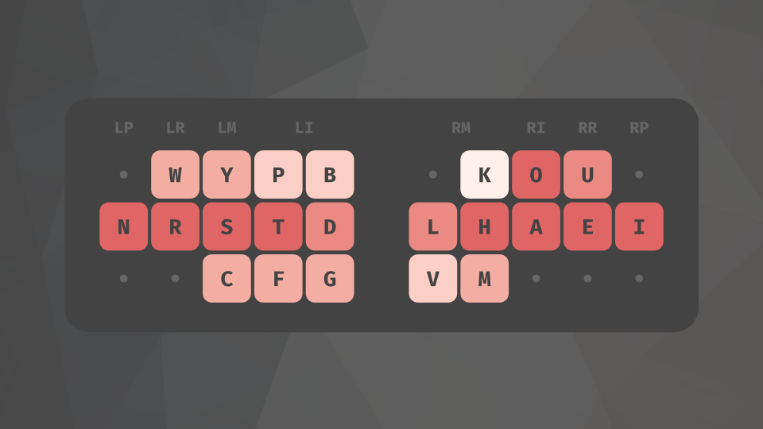
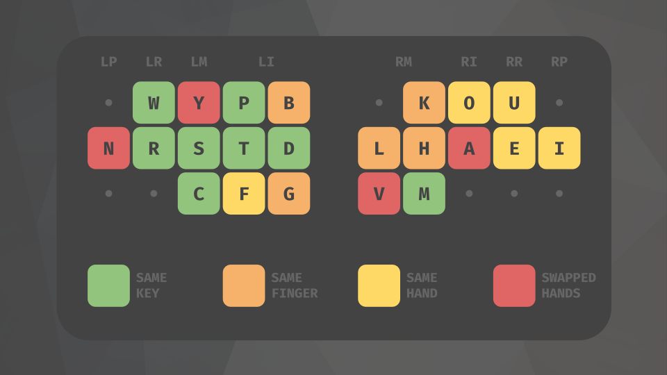

# NRSTmak


## Background
For the past few years I've been using the [Colemak](https://colemak.com/) layout. It's a great layout, and [I've built up a decent speed on it](https://www.youtube.com/watch?v=rECAwQ8GrgM), but there are a few issues with it that I've noticed that motivated me to make this new layout:

#### The Right Index
Colemak puts a lot of strain on the right index by placing H, L, M, and N on the index column. Not only are these letters very common (making up nearly 20% of all letters typed in English), but they also appear frequently together in close proximity. For example, NK and KN, which are found in common words such as `know` and `think`, would be typed with the same finger on Colemak. These sequences are known as SFBs, or "same-finger bigrams", and are generally detrimental to speed and comfort.

Additionally, placing H on the outer index results in a lot of LSBs, or "lateral stretch bigrams". HE is a very common LSB on Colemak and is generally uncomfortable because it requires your fingers to splay.

#### The Left Pinky
On Colemak, A is placed on the left hand with the consonants, most likely to maintain similarity with Qwerty. However, this placement results in a lot of pinky trills with words such as `separate` and `arrange`. Pinky and ring fingers are usually not as dexterous as the middle and index fingers, and so over time these trilling motions, also known as "redirects", can cause strain.

#### The Letter Y
The placement of the letter Y on Colemak is also often a source of discomfort. For example, `you`, despite being a fairly common word, is also a fairly uncomfortable redirect on Colemak. 

## Modifications
I tried to keep the changes as minimal as possible, both to maintain the original feel of Colemak and to make the transitioning process simpler. Here's a summary of the changes:

- I moved N off of the right index to reduce the total use of that finger by 7% and to also remove common SFBs such as NK. This change also made it possible to put H on the home index position, which removes the very common HE LSB. 
- I moved A off of the left pinky to reduce the awkward trilling sequences I mentioned earlier.
- I moved Y off of the right ring to remove the common `you` redirect.

In order accommodate these changes I needed to restructure the vowel hand significantly in order to keep the SFBs down. This means that the weight of the right hand has shifted off of the index and more towards the middle and ring fingers, which balances out the load better. Luckily, the left hand needed very few changes - resulting in only a slight increase to the left index weight. 



## Miscellaneous Notes
- I didn't include the locations of punctuation and the letters Z, X, Q, and Z in the images because these keys are relatively uncommon compared to the rest of the letters. In the full layout ZXQJ are in their original Qwerty/Colemak spots and the punctuation is optimized to minimize SFBs; however, you can customize the placements to best suit your needs.
- This layout works well on both standard, row-staggered keyboards and on state-of-the-art ortholinear keyboards. If you want to use a row-stag keyboard with this layout, you could also consider using an [angle-mod](https://colemakmods.github.io/ergonomic-mods/angle.html) version of this layout, which would promote a more comfortable left hand wrist angle.
- As for my personal experience using this layout, I've fully switched over to using it full-time, and I currently type on it at around 110 WPM. 

## Layout
Here's the layout in text-form for copy/pasting into your favorite keyboard analysis tools.
```
q w y p b  j k o u ,
n r s t d  l h a e i
z x c f g  v m ' ; .
```
